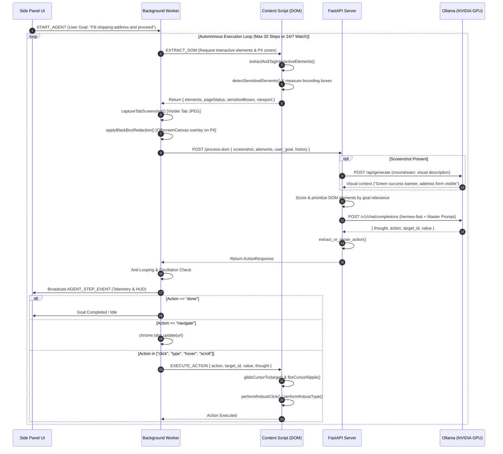

# 👁️ Vision-Agent for Browser Automation

> **Next-Generation Autonomous Web Agent powered by Local Vision Models, Real-Time DOM Parsing, and Native GPU Acceleration.**

Vision-Agent for Browser Automation is an enterprise-grade, local-first browser automation platform. It fuses **visual perception** (screenshots processed via lightweight vision models) with **structural DOM understanding** (dynamically indexed and prioritized interactive nodes) to navigate web applications, fill complex forms, monitor dashboards 24/7, and execute human-like browsing workflows with zero cloud latency and complete data privacy.

---

## 📑 Table of Contents
- [Architectural Overview](#-architectural-overview)
- [System Architecture Diagram](#-system-architecture-diagram)
- [Deep Dive: DOM Extraction & Structural Pipeline](#-deep-dive-dom-extraction--structural-pipeline)
- [Privacy-First PII Black-Box Redaction](#-privacy-first-pii-black-box-redaction)
- [Physical Cursor & Action Execution Engine](#-physical-cursor--action-execution-engine)
- [Dual-Model Multimodal AI Pipeline](#-dual-model-multimodal-ai-pipeline)
- [Anti-Looping & Convergence Safeguards](#-anti-looping--convergence-safeguards)
- [NVIDIA RTX GPU & Ollama Optimization](#-nvidia-rtx-gpu--ollama-optimization)
- [Repository Structure](#-repository-structure)
- [Getting Started & Installation](#-getting-started--installation)
- [API & Message Specifications](#-api--message-specifications)

---

## 🏛️ Architectural Overview

The platform is engineered as a three-tier distributed pipeline:

```
┌──────────────────────────────────────────────────────────────────────────────────┐
│                             CHROME BROWSER EXTENSION                             │
│  ┌───────────────────────┐  ┌─────────────────────────┐  ┌────────────────────┐  │
│  │   Side Panel UI       │  │ Background Service      │  │ Content Script     │  │
│  │   - Cyber-glass HUD   │  │ Worker                  │  │ - Virtual Cursor   │  │
│  │   - Live Redaction QA │  │ - Tab capture           │  │ - DOM Tagging      │  │
│  │   - Telemetry stream  │  │ - Offscreen Canvas Mask │  │ - W3C Event Engine │  │
│  │   - Step controls     │  │ - Action orchestrator   │  │ - PII Detector     │  │
│  └───────────────────────┘  └─────────────────────────┘  └────────────────────┘  │
└──────────────────────────────────────┬───────────────────────────────────────────┘
                                       │ HTTP POST /process-dom (JSON + B64 Image)
                                       ▼
┌──────────────────────────────────────────────────────────────────────────────────┐
│                           FASTAPI ORCHESTRATION SERVER                           │
│  ┌────────────────────────────────────────────────────────────────────────────┐  │
│  │  - Single-Action Goal Completion Detector                                  │  │
│  │  - Keyword-Relevance DOM Prioritization & Semantic Scoring                 │  │
│  │  - Master System Prompt (Pre-cached in KV VRAM)                            │  │
│  │  - Resilient JSON Repair & 502 Auto-Recovery Fallback                      │  │
│  └───────────────────────────────────┬────────────────────────────────────────┘  │
└──────────────────────────────────────┼───────────────────────────────────────────┘
                                       │ REST / OpenAI-Compatible API (:11434)
                                       ▼
┌──────────────────────────────────────────────────────────────────────────────────┐
│                       LOCAL OLLAMA INFERENCE ENGINE (GPU)                        │
│  ┌───────────────────────────────────┐    ┌───────────────────────────────────┐  │
│  │ Moondream 1.8B (Vision Sensor)    │    │ Hermes-Fast / Llama 3.1 8B (Brain)│  │
│  │ - Analyzes layout, banners, alerts│    │ - Determines surgical next step   │  │
│  │ - 100% VRAM Resident              │    │ - Outputs strict JSON action      │  │
│  └───────────────────────────────────┘    └───────────────────────────────────┘  │
└──────────────────────────────────────────────────────────────────────────────────┘
```

1. **Client Tier (Chrome MV3 Extension)**:
   - **`content.js`**: Injected into the active web page. Continuously tags interactive elements, runs MutationObservers, generates virtual cursor animations, and executes realistic human mouse/keyboard events.
   - **`background.js`**: Central service worker. Coordinates tab capture, handles offscreen canvas black-box masking of sensitive data, coordinates anti-looping safeguards, and directs network calls.
   - **`sidepanel.js`**: Real-time glassmorphism control panel providing step streaming, manual interventions, and live visual monitoring.

2. **Server Tier (FastAPI Orchestrator - `server/main.py`)**:
   - Normalizes and ranks the DOM candidate tree against the user goal.
   - Coordinates multimodal inference: dispatches visual captures to the vision sensor and structured DOM representations to the decision model.
   - Enforces deterministic output syntax and repairs damaged JSON structures.

3. **Inference Tier (Local Ollama on NVIDIA GPU)**:
   - Powered by a custom **`hermes-fast`** model (fine-tuned Llama 3.1 8B Instruct) alongside **`moondream`** (compact vision model), fully offloaded to dedicated GPU VRAM.

---

## 📊 System Architecture Diagram



---

## 🌳 Deep Dive: DOM Extraction & Structural Pipeline

Automating dynamic web applications (React, Angular, Vue, Web Components) requires overcoming standard shadow DOM limits, nested click-handlers, and context-window token overflow. The DOM engine solves this through a multi-stage filtering and prioritization pipeline.

### 1. Element Candidate Extraction (`content.js`)
Interactive nodes are gathered using a composite selector combining native form elements, ARIA semantics, and interactive CSS roles:

```javascript
const selector = [
  'button', 'input:not([type="hidden"])', 'textarea', 'select', 'a[href]',
  '[role="button"]', '[role="link"]', '[role="tab"]', '[role="menuitem"]',
  '[role="checkbox"]', '[role="radio"]', '[role="switch"]', '[role="option"]',
  '[role="textbox"]', '[role="searchbox"]', '[role="combobox"]',
  '[tabindex="0"]', '[contenteditable="true"]', 'label[for]'
].join(', ');
```

In addition, modern web apps use styled `div`, `span`, or `li` elements with `cursor: pointer`. The engine scans these cards if they contain concise, direct text (`<= 80 chars`) and no more than 2 child containers.

### 2. Strict Visibility & Geometry Culling
Elements must pass `isStrictlyVisible()`:
- `rect.width > 0` and `rect.height > 0`
- Computed style: `display !== 'none'`, `visibility !== 'hidden'`, `opacity !== '0'`, `pointer-events !== 'none'`
- Ignored if internal to agent UI (`#hermes-virtual-cursor`, `#agent-action-hud`, `.hermes-target-highlight`)

### 3. Parent-Child Deduplication
Nested targets (e.g., `<button><span>Click me</span></button>`) are deduplicated: if a parent element is already interactive, its children are consolidated under the parent node to prevent duplicate, conflicting agent clicks.

### 4. Goal-Aligned Relevance Scoring (`server/main.py`)
Sending raw HTML of an entire webpage exhausts token context. The backend uses a multi-tier scoring algorithm:
1. **Keyword Match**: Calculates overlap between meaningful goal tokens (excluding stop words) and element properties (`text`, `name`, `aria_label`, `value`, `type`).
2. **Tag Preference**: Prioritizes `input`/`textarea` (Tier 0) over `button`/`submit` (Tier 1) over textual links (Tier 2).
3. **Viewport Proximity**: Elements within the current viewport window are prioritized over elements below the fold.

### 5. Compact DOM Encoding Schema
The prioritized elements are serialized into an ultra-condensed prompt format:

```text
- ID 0: <input type="text" name="shipping_name" placeholder="Full Name">
- ID 1: <input type="email" name="user_email" value="alex@example.com">
- ID 2: <textarea name="address_line" text="Enter street address">
- ID 3: <button type="submit" text="Continue to Payment">
- ID 4: <a href="/cart" text="Return to Cart">
```

Each element is tagged with a temporary `data-agent-id="<index>"` in the live DOM, allowing the LLM to refer directly to integer IDs.

---

## 🔒 Privacy-First PII Black-Box Redaction

Web automation often deals with sensitive credentials, financial details, or personal identities. Vision-Agent features a **Zero-Leak Client-Side Masking Pipeline**:

### 1. Client-Side Pattern Detection
`content.js` monitors text, attributes, and input values using regular expressions covering international and Indian compliance standards:
- **Email**: `/\b[A-Z0-9._%+-]+@[A-Z0-9.-]+\.[A-Z]{2,}\b/gi`
- **Phone Numbers**: `/(?<!\d)(?:\+91[\s-]?)?[6-9]\d{9}(?!\d)/g`
- **Aadhaar Numbers**: `/(?<!\d)\d{4}[\s-]?\d{4}[\s-]?\d{4}(?!\d)/g`
- **PAN Cards**: `/\b[A-Z]{5}\d{4}[A-Z]\b/gi`
- **Credit Cards**: `/(?<!\d)(?:\d[ -]?){13,19}(?!\d)/g`
- **IFSC Codes & Passports**
- **Form Inputs**: Any `<input type="password">` or fields named `login`, `email`, `login_field`, `auth`.

### 2. Offscreen Canvas Image Masking (`background.js`)
Rather than breaking website styling by altering the live DOM, redaction is applied directly to the captured screenshot buffer via `OffscreenCanvas`:
1. Bounding boxes (`{ x, y, width, height }`) of all sensitive elements are gathered via `getBoundingClientRect()`.
2. Coordinates are scaled by `devicePixelRatio` to match physical canvas pixels.
3. The background worker paints solid `#000000` rectangles over every sensitive coordinate.
4. The redacted image is converted back to base64 JPEG before sending to the backend.

> **Result**: The local vision model and server never receive raw PII pixels or plain-text password strings, while the user's actual browser display remains crisp and untouched.

---

## 🖱️ Physical Cursor & Action Execution Engine

Headless clicks often fail on modern anti-bot frameworks, single-page applications (SPAs), and dynamic frameworks that track mouse trajectories. Vision-Agent executes natural, physical interactions:

### 1. Natural Bezier Mouse Glide
When an action is initiated, the virtual cursor glides across the screen to the target's center coordinates using a cubic-bezier easing curve:
$$\text{ease}(t) = 1 - (1 - t)^3$$
A glowing emerald SVG cursor follows this path, accompanied by a dynamic action pill (e.g. `🎯 Clicking...`, `⌨️ Typing...`).

### 2. Full W3C Synthetic Event Chain
Simple `.click()` calls frequently fail on React/Vue buttons that require pointer events. `performRobustClick()` dispatches the complete sequence:
1. `scrollIntoView({ behavior: 'auto', block: 'center' })`
2. `document.elementFromPoint(x, y)` to identify topmost overlays.
3. `PointerEvent('pointermove')` $\rightarrow$ `MouseEvent('mousemove')`
4. `PointerEvent('pointerdown')` $\rightarrow$ `MouseEvent('mousedown')`
5. `targetElement.focus()`
6. 40ms micro-pause (simulating human actuation delay)
7. `PointerEvent('pointerup')` $\rightarrow$ `MouseEvent('mouseup')`
8. `MouseEvent('click')`
9. Native fallback execution for anchors (`<a>`), checkboxes, and form submit triggers.

### 3. Framework-Aware Input Simulator
Modern frontend frameworks intercept standard `input.value = "text"` assignments. `performRobustType()` resolves this by:
- **Standard Inputs**: Accessing the native property setter descriptor (`HTMLInputElement.prototype` / `HTMLTextAreaElement.prototype`) to bypass React's synthetic event wrappers.
- **Micro-Typing Loop**: Typing character-by-character with 12ms realistic keystroke delays, dispatching `keydown`, `keypress`, `input`, and `keyup` for every character.
- **Search Optimization**: Automatically fires `Enter` key codes when typing into detected search bars.
- **Rich Text Editors**: Supporting `contenteditable` nodes (Claude, Notion, Google Docs) via `Selection`, `Range`, and `document.execCommand('insertText')`.

---

## 🧠 Dual-Model Multimodal AI Pipeline

The server utilizes a two-tier inference strategy:

```
                      ┌────────────────────────┐
                      │  Base64 Redacted JPEG  │
                      └───────────┬────────────┘
                                  ▼
┌─────────────────────────────────────────────────────────────────┐
│               STAGE 1: VISION PERCEPTION SENSOR                 │
│                      (Moondream 1.8B)                           │
│  - Evaluates page geometry, modals, cookie banners, toast alerts│
│  - Captures layout context inaccessible via pure DOM            │
│  - Emits: "Detected a center checkout modal blocking the form"  │
└─────────────────────────────────┬───────────────────────────────┘
                                  │
                                  ▼ (Visual Context String)
┌─────────────────────────────────────────────────────────────────┐
│               STAGE 2: STRATEGIC DECISION BRAIN                 │
│                 (Hermes-Fast / Llama 3.1 8B)                    │
│  - Inputs: Master System Prompt (KV Cached)                     │
│            + Visual Context + Goal Directives                   │
│            + Recent Action History + Filtered DOM Table         │
│  - Emits: Strict JSON Action                                    │
└─────────────────────────────────────────────────────────────────┘
```

### Supported Actions
| Action | Description | `target_id` | `value` |
|---|---|---|---|
| `click` | Clicks interactive button, link, checkbox, or card | `int` (DOM ID) | `null` |
| `type` | Focuses input/textarea and inputs realistic text | `int` (DOM ID) | `string` (Text to enter) |
| `hover` | Dispatches hover and pointer enter events | `int` (DOM ID) | `null` |
| `scroll` | Scrolls viewport up or down | `null` | `"down"` or `"up"` |
| `navigate`| Directly changes window location to URL | `null` | `string` (Target URL) |
| `done` | Marks user goal fulfilled or enters idle monitoring | `null` | `null` |

---

## 🛡️ Anti-Looping & Convergence Safeguards

Autonomous web agents can easily get caught in infinite interaction loops (e.g., clicking the same tab repeatedly or oscillating between two options). The platform implements defense mechanisms across both the client and server:

1. **Consecutive Action Limiter**: If the agent attempts the exact same action on the same `target_id` with the same value 2 or more times, the background script intercepts the step, overrides the action to `done`, and notifies the user.
2. **Ping-Pong Oscillation Breaker**: The system tracks rolling action history across 6 steps. If an alternating sequence ($A \rightarrow B \rightarrow A \rightarrow B$) is detected, the loop is terminated.
3. **Single-Action Fast Path**: If the user's prompt is a single command (e.g., *"Click on Submit"*), the server scans `previous_actions`. As soon as a click matching the keyword occurs, it returns `done` on the next cycle, avoiding unnecessary trailing steps.
4. **Interacted Element Tracking**: Acted-upon DOM nodes receive `data-agent-interacted="true"`, allowing the LLM prompt to indicate `already_clicked=true`.

---

## ⚡ NVIDIA RTX GPU & Ollama Optimization

The architecture is configured for modern desktop and mobile NVIDIA GPUs, including the **RTX 5060 Laptop GPU** (Blackwell architecture, CUDA 13.2, Compute Capability 12.0).

### Key Performance Configurations
- **Optimus Sleep Wake-Up**: Windows laptops power down discrete GPUs into `D3Cold` states. The included [start_gpu_ollama.ps1](file:///d:/Saarthak%20Dutta/code/hackathon/Vision-agent-for-Browser-Automation/start_gpu_ollama.ps1) script probes `nvidia-smi` first to wake the dGPU before Ollama runs hardware discovery.
- **Layer Offloading (`num_gpu 999`)**: All 32 transformer layers of Llama 3.1 8B are placed in VRAM.
- **Flash Attention (`OLLAMA_FLASH_ATTENTION=1`)**: Enables accelerated scaled dot-product attention kernels.
- **Permanent Model Residency (`keep_alive: -1`)**: Pre-warms model weights and keeps the `MASTER_SYSTEM_PROMPT` in KV cache indefinitely, reducing per-step token evaluation time from seconds to milliseconds.
- **Low-Latency Sampling**: Temperature is pinned to `0.05` - `0.1` with `num_predict: 250` for deterministic, low-latency JSON completions.

---

## 📁 Repository Structure

```
Vision-agent-for-Browser-Automation/
│
├── README.md                      # Comprehensive Architecture & System Guide
├── start_gpu_ollama.ps1           # Automated script for 100% GPU offload on RTX 5060
├── test_page.html                 # Comprehensive automation testbed & QA playground
│
├── extension/                     # Chrome Extension (Manifest V3)
│   ├── manifest.json              # Extension metadata, permissions & panel declarations
│   ├── background.js              # Service worker, tab capture, OffscreenCanvas PII masking
│   ├── content.js                 # DOM parser, virtual cursor, W3C click/typing dispatcher
│   ├── sidepanel.html             # Cyber-glass side panel dashboard
│   ├── sidepanel.js               # Side panel controller & telemetry broadcast listener
│   ├── sidepanel.css              # Side panel layout, animations & theme
│   ├── glass.css                  # Reusable backdrop-filter glassmorphism tokens
│   └── input.css                  # UI input styles
│
└── server/                        # FastAPI Backend & Orchestrator
    ├── main.py                    # Multi-tier DOM ranker, vision pipeline & Ollama bridge
    ├── Modelfile                  # Ollama Modelfile fine-tuned for high-speed deterministic JSON
    └── requirements.txt           # Python dependencies (FastAPI, Uvicorn, OpenAI, HTTPX)
```

---

## 🚀 Getting Started & Installation

### Prerequisites
- **Google Chrome** (v116+ for Side Panel API support).
- **Python 3.10+**
- **NVIDIA GPU** with current drivers + [Ollama](https://ollama.ai) installed.

---

### Step 1: Initialize Ollama on Dedicated GPU

1. Pull the base models:
   ```bash
   ollama pull llama3.1
   ollama pull moondream
   ```
2. Build the optimized `hermes-fast` model:
   ```bash
   cd server
   ollama create hermes-fast -f Modelfile
   ```
3. Run the GPU startup script to guarantee 100% GPU VRAM residency:
   ```powershell
   # Run from repository root
   .\start_gpu_ollama.ps1
   ```
   *Verify with `ollama ps` that both models display `100% GPU`.*

---

### Step 2: Start the FastAPI Backend

1. Navigate to the server folder and set up your virtual environment:
   ```bash
   cd server
   python -m venv venv
   .\venv\Scripts\activate
   pip install -r requirements.txt
   ```
2. Launch the backend service:
   ```bash
   uvicorn server.main:app --host 127.0.0.1 --port 8000 --reload
   ```
3. Verify the server is running by opening:
   - **Health Endpoint**: [http://localhost:8000/health](http://localhost:8000/health) (Reports model readiness and GPU VRAM)
   - **Built-in Test Suite**: [http://localhost:8000/test](http://localhost:8000/test)

---

### Step 3: Install the Chrome Extension

1. Open Google Chrome and navigate to `chrome://extensions/`.
2. Toggle **Developer mode** in the top-right corner.
3. Click **Load unpacked**.
4. Select the `extension/` directory from this repository.
5. Click the extension puzzle icon in Chrome and pin **Hermes Vision Agent**.
6. Clicking the icon will open the **Cyber-Glass Side Panel**.

---

### Step 4: Run an Automation Task

1. Navigate to any page (or use the built-in [http://localhost:8000/test](http://localhost:8000/test)).
2. In the Side Panel:
   - Enter your goal: *"Fill out the contact form with name John Doe and click Submit"*
   - Click **Run Autonomous** for a step-by-step task completion loop, or **24/7 Watch** for continuous monitoring.
3. Watch the virtual cursor physically navigate, glide across targets, type values, and submit the form with real-time HUD status badges.

---

## 📡 API & Message Specifications

### Backend REST API

#### `POST /process-dom`
Processes DOM state and visual capture to determine the next action.

- **Request Body**:
  ```json
  {
    "screenshot": "<base64 encoded JPEG without header>",
    "elements": [
      {
        "id": 0,
        "tag": "button",
        "type": null,
        "text": "Submit Order",
        "name": "btn_submit",
        "value": null,
        "href": null,
        "aria_label": "Submit",
        "disabled": false,
        "interacted": false
      }
    ],
    "user_goal": "Complete checkout",
    "page_status": "Items in cart: 1",
    "previous_actions": [
      {
        "step": 1,
        "action": "click",
        "target_id": 4,
        "target_text": "Cart",
        "value": null,
        "thought": "Navigating to cart"
      }
    ]
  }
  ```

- **Response Body**:
  ```json
  {
    "thought": "Clicking the submit order button to complete the transaction.",
    "action": "click",
    "target_id": 0,
    "value": null
  }
  ```

#### `GET /health`
Returns runtime status and GPU utilization.

- **Response**:
  ```json
  {
    "status": "healthy",
    "model": "hermes-fast",
    "vision_model": "moondream",
    "loaded_models": ["hermes-fast:latest", "moondream:latest"],
    "gpu": true,
    "total_vram_mb": 4896.0
  }
  ```

---

### Extension Internal Message Bus

| Message Type | Sender | Receiver | Payload | Description |
|---|---|---|---|---|
| `START_AGENT` | Side Panel | Background | `{ tabId, user_goal }` | Initiates standard autonomous loop |
| `START_CONTINUOUS`| Side Panel | Background | `{ tabId, user_goal }` | Initiates 24/7 continuous watch loop |
| `STOP_AGENT` | Side Panel | Background | `{}` | Requests immediate loop termination |
| `EXTRACT_DOM` | Background | Content | `{}` | Requests interactive element extraction & PII zones |
| `EXECUTE_ACTION` | Background | Content | `{ payload }` | Dispatches physical cursor and mouse/key events |
| `CLEAR_AGENT_STATE`| Background | Content | `{}` | Clears virtual cursor, HUD, and interaction marks |
| `AGENT_STEP_EVENT` | Background | Side Panel | `{ step, actionData }` | Broadcasts step telemetry and model reasoning |
| `AGENT_STATUS_EVENT`| Background | Side Panel | `{ status, message }` | Broadcasts state transitions (`RUN`, `IDLE`, `DONE`, `ERR`) |

---

## 📄 License
Distributed under the MIT License. See `LICENSE` for more information.
